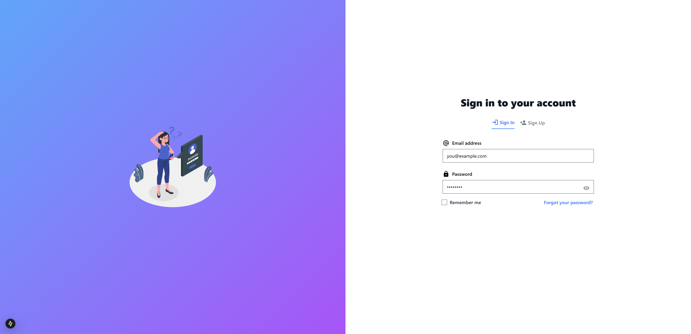
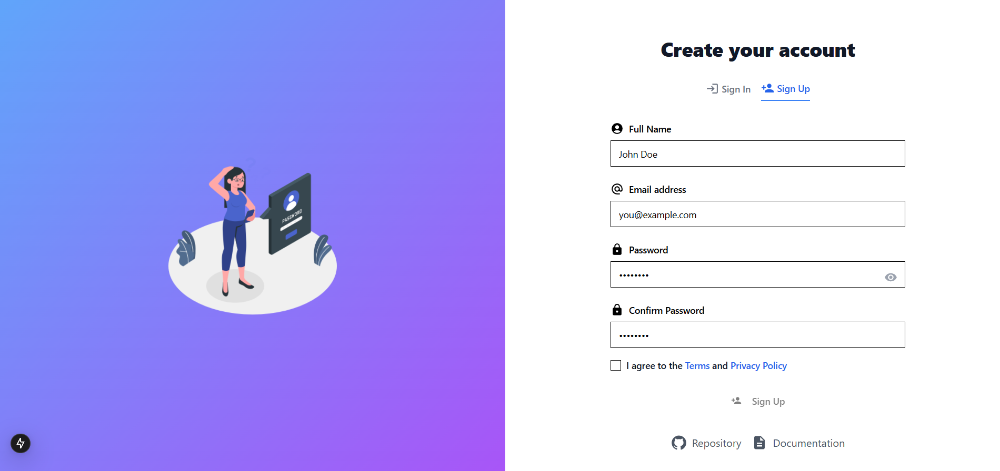
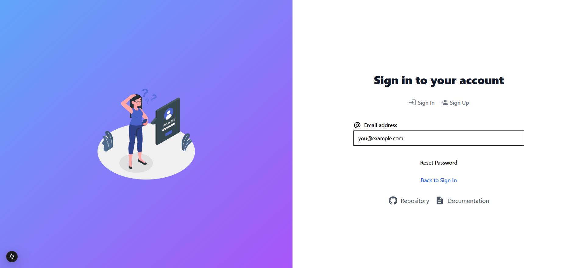
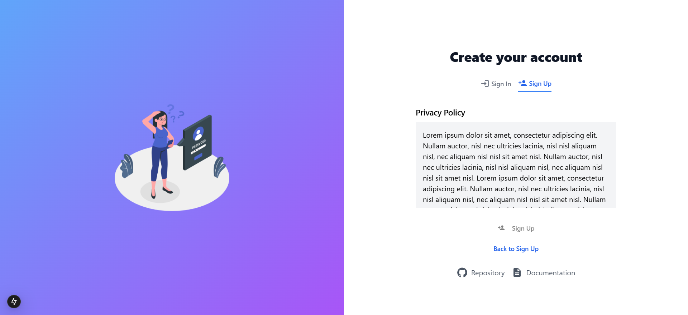

# Sign In / Sign Up Application - Design & UX Analysis

A comprehensive design and UX analysis of the Next.js authentication application that integrates Sign In, Sign Up, Forgot Password, Privacy Policy, and Terms of Service pages into a single, beautifully animated and visually cohesive experience.

---

## Table of Contents

1. [Overview](#overview)
2. [Page Screenshots](#page-screenshots)
3. [Color Palette](#color-palette)
4. [Typography](#typography)
5. [Layout & Responsive Grid Structure](#layout--responsive-grid-structure)
6. [Animations & Transitions](#animations--transitions)
7. [Component Styling](#component-styling)
8. [Spacing, Padding & Margins](#spacing-padding--margins)
9. [User Experience Flow](#user-experience-flow)
10. [Micro-interactions & Hover States](#micro-interactions--hover-states)
11. [Technical Implementation](#technical-implementation)

---

## Overview

This application presents a modern, single-page authentication experience built with Next.js 15, React, Framer Motion, and Tailwind CSS. The design philosophy centers around:

- **Unified Experience**: All authentication flows (Sign In, Sign Up, Forgot Password) exist within a single view
- **Smooth Animations**: Framer Motion powers fluid transitions between states
- **Split-Panel Layout**: A vibrant gradient illustration panel paired with a clean white form panel
- **Progressive Disclosure**: Terms and Privacy Policy content appears inline without navigation

---

## Page Screenshots

### Sign In Page



The default landing state featuring:

- Email and Password input fields
- "Remember me" checkbox
- "Forgot your password?" link
- Sign In / Sign Up tab navigation

### Sign Up Page



Extended registration form including:

- Full Name field
- Email address field
- Password with visibility toggle
- Confirm Password field
- Terms and Privacy Policy agreement checkbox
- Disabled Sign Up button (until terms accepted)

### Forgot Password Page



Simplified recovery flow with:

- Single email input field
- "Reset Password" button
- "Back to Sign In" navigation link

### Terms of Service


Inline content display featuring:

- Scrollable content container
- Gray background content area
- "Back to Sign Up" navigation

### Privacy Policy



Identical layout to Terms of Service with:

- Privacy Policy heading
- Scrollable legal content
- Return navigation

---

## Color Palette

### Primary Colors

| Color Name             | HSL Value        | Hex Equivalent | RGB                  | Usage                       |
| ---------------------- | ---------------- | -------------- | -------------------- | --------------------------- |
| **Background**         | `hsl(0 0% 100%)` | `#FFFFFF`      | `rgb(255, 255, 255)` | Page background, form panel |
| **Foreground**         | `hsl(0 0% 3.9%)` | `#0A0A0A`      | `rgb(10, 10, 10)`    | Primary text                |
| **Primary**            | `hsl(0 0% 9%)`   | `#171717`      | `rgb(23, 23, 23)`    | Buttons, active states      |
| **Primary Foreground** | `hsl(0 0% 98%)`  | `#FAFAFA`      | `rgb(250, 250, 250)` | Button text                 |

### Secondary Colors

| Color Name           | HSL Value         | Hex Equivalent | RGB                  | Usage             |
| -------------------- | ----------------- | -------------- | -------------------- | ----------------- |
| **Secondary**        | `hsl(0 0% 96.1%)` | `#F5F5F5`      | `rgb(245, 245, 245)` | Secondary buttons |
| **Muted**            | `hsl(0 0% 96.1%)` | `#F5F5F5`      | `rgb(245, 245, 245)` | Disabled states   |
| **Muted Foreground** | `hsl(0 0% 45.1%)` | `#737373`      | `rgb(115, 115, 115)` | Placeholder text  |

### Accent Colors

| Color Name         | Hex Value | RGB                 | Usage                            |
| ------------------ | --------- | ------------------- | -------------------------------- |
| **Blue Primary**   | `#3B82F6` | `rgb(59, 130, 246)` | Active tab indicator, links      |
| **Blue Hover**     | `#2563EB` | `rgb(37, 99, 235)`  | Link hover states                |
| **Gradient Start** | `#60A5FA` | `rgb(96, 165, 250)` | Left panel gradient (blue-400)   |
| **Gradient End**   | `#A855F7` | `rgb(168, 85, 247)` | Left panel gradient (purple-500) |

### Feedback Colors

| Color Name        | Hex Value | RGB                  | Usage                            |
| ----------------- | --------- | -------------------- | -------------------------------- |
| **Success Green** | `#22C55E` | `rgb(34, 197, 94)`   | Valid input indicator            |
| **Error Red**     | `#EF4444` | `rgb(239, 68, 68)`   | Invalid input indicator          |
| **Gray 100**      | `#F3F4F6` | `rgb(243, 244, 246)` | Terms/Privacy content background |
| **Gray 500**      | `#6B7280` | `rgb(107, 114, 128)` | Inactive tab text                |
| **Gray 600**      | `#4B5563` | `rgb(75, 85, 99)`    | Footer link text                 |
| **Gray 900**      | `#111827` | `rgb(17, 24, 39)`    | Heading text                     |

### Border & Input Colors

| Color Name | HSL Value         | Hex Equivalent | Usage                   |
| ---------- | ----------------- | -------------- | ----------------------- |
| **Border** | `hsl(0 0% 89.8%)` | `#E5E5E5`      | Input borders, dividers |
| **Input**  | `hsl(0 0% 89.8%)` | `#E5E5E5`      | Input field borders     |
| **Ring**   | `hsl(0 0% 3.9%)`  | `#0A0A0A`      | Focus ring color        |

### CSS Custom Properties (from globals.css)

```css
:root {
  --background: 0 0% 100%;
  --foreground: 0 0% 3.9%;
  --primary: 0 0% 9%;
  --primary-foreground: 0 0% 98%;
  --secondary: 0 0% 96.1%;
  --secondary-foreground: 0 0% 9%;
  --muted: 0 0% 96.1%;
  --muted-foreground: 0 0% 45.1%;
  --accent: 0 0% 96.1%;
  --accent-foreground: 0 0% 9%;
  --destructive: 0 84.2% 60.2%;
  --border: 0 0% 89.8%;
  --input: 0 0% 89.8%;
  --ring: 0 0% 3.9%;
  --radius: 0.5rem;
}
```

---

## Typography

### Font Family

```css
body {
  font-family: Arial, Helvetica, sans-serif;
}
```

The application uses a system font stack for optimal performance and native appearance across platforms.

### Type Scale & Hierarchy

| Element           | Class                     | Size            | Weight | Line Height | Usage                                             |
| ----------------- | ------------------------- | --------------- | ------ | ----------- | ------------------------------------------------- |
| **Page Heading**  | `text-3xl font-extrabold` | 30px (1.875rem) | 800    | 1.2         | "Sign in to your account" / "Create your account" |
| **Section Title** | `text-lg font-semibold`   | 18px (1.125rem) | 600    | 1.5         | "Terms of Service" / "Privacy Policy"             |
| **Label**         | `text-sm font-medium`     | 14px (0.875rem) | 500    | 1.25        | Form field labels                                 |
| **Body Text**     | `text-sm`                 | 14px (0.875rem) | 400    | 1.5         | General body text                                 |
| **Input Text**    | `text-base md:text-sm`    | 16px / 14px     | 400    | 1.5         | Form input values                                 |
| **Link Text**     | `text-sm font-medium`     | 14px (0.875rem) | 500    | 1.25        | Navigation links                                  |
| **Button Text**   | `text-sm font-medium`     | 14px (0.875rem) | 500    | 1.25        | Button labels                                     |
| **Placeholder**   | `text-muted-foreground`   | 14px (0.875rem) | 400    | 1.5         | Input placeholders                                |

### Text Colors

| Purpose         | Class                 | Color     |
| --------------- | --------------------- | --------- |
| Primary heading | `text-gray-900`       | `#111827` |
| Body text       | `text-foreground`     | `#0A0A0A` |
| Muted/Secondary | `text-gray-500`       | `#6B7280` |
| Links           | `text-blue-600`       | `#2563EB` |
| Link hover      | `hover:text-blue-500` | `#3B82F6` |
| Success         | `text-green-600`      | `#16A34A` |
| Error           | `text-red-500`        | `#EF4444` |

### Font Pairing Rationale

The use of Arial/Helvetica provides:

- **Universal Compatibility**: Available on all operating systems
- **Optimal Legibility**: Clean, sans-serif design ideal for form interfaces
- **Performance**: No external font loading required
- **Neutral Aesthetic**: Doesn't compete with the visual gradient illustration

---

## Layout & Responsive Grid Structure

### Overall Page Structure

```
+------------------------------------------+
|                  main                     |
|  flex min-h-screen flex-col lg:flex-row  |
+------------------------------------------+
|  Left Panel (lg:w-1/2)  |  Right Panel   |
|  - Hidden on mobile     |  (w-full/lg:1/2)|
|  - Gradient background  |  - White bg    |
|  - Lottie animation     |  - Form content|
+------------------------------------------+
```

### Breakpoints

| Breakpoint  | Width     | Layout Behavior          |
| ----------- | --------- | ------------------------ |
| **Default** | < 1024px  | Single column, form only |
| **lg**      | >= 1024px | Two-column split layout  |
| **2xl**     | 1400px    | Max container width      |

### Container Configuration

```typescript
container: {
  center: true,
  padding: "2rem",
  screens: {
    "2xl": "1400px",
  },
}
```

### Panel Dimensions

| Panel                   | Mobile                | Desktop                        |
| ----------------------- | --------------------- | ------------------------------ |
| **Left (Illustration)** | Hidden (`hidden`)     | 50% width (`lg:flex lg:w-1/2`) |
| **Right (Form)**        | 100% width (`w-full`) | 50% width (`lg:w-1/2`)         |

### Form Container

```css
.form-container {
  width: 100%;
  max-width: 28rem; /* max-w-md = 448px */
  margin: 0 auto;
  padding: 1rem; /* p-4 */
}

@media (min-width: 640px) {
  .form-container {
    padding: 2rem; /* sm:p-8 */
  }
}
```

### Centering Strategy

- **Outer Container**: `flex min-h-screen flex-col items-center justify-center`
- **Form Wrapper**: `w-full max-w-md` - constrains form width on larger screens
- **Left Panel**: `lg:flex lg:items-center lg:justify-center` - centers Lottie animation

---

## Animations & Transitions

### Animation Library

The application uses **Framer Motion** for all animations with custom easing functions.

### Custom Parabolic Easing

```typescript
const parabolicEasing = (t: number) => {
  return 1 - Math.pow(1 - t, 2);
};
```

This creates a smooth deceleration curve (ease-out parabolic), providing a natural, physics-based feel.

### Slide-In Animation Variants

```typescript
const slideInVariants = {
  hidden: {
    opacity: 0,
    x: -50,
  },
  visible: (i: number) => ({
    opacity: 1,
    x: 0,
    transition: {
      delay: i * 0.3, // Staggered delay
      duration: 0.75, // 750ms duration
      ease: parabolicEasing,
    },
  }),
};
```

### Animation Sequence

| Element              | Custom Index | Delay       | Duration |
| -------------------- | ------------ | ----------- | -------- |
| Page Heading         | 0            | 0ms         | 750ms    |
| Tab Navigation       | 1            | 300ms       | 750ms    |
| Name Field (Sign Up) | 2            | 600ms       | 750ms    |
| Email Field          | 3            | 900ms       | 750ms    |
| Password Field       | 4            | 1200ms      | 750ms    |
| Confirm Password     | 5            | 1500ms      | 750ms    |
| Remember Me / Terms  | 5-6          | 1500-1800ms | 750ms    |
| Submit Button        | 7            | 2100ms      | 750ms    |
| Footer Links         | 8            | 2400ms      | 750ms    |

### Page Load Animation

```typescript
// Left panel entrance
initial={{ opacity: 0, x: -100 }}
animate={{ opacity: 1, x: 0 }}
transition={{
  delay: 2,           // 2 second delay (after loading spinner)
  duration: 0.75,
  ease: parabolicEasing
}}
```

### Loading State

```typescript
// Loading spinner wrapper
initial={{ opacity: 1 }}
exit={{ opacity: 0 }}
```

- **Duration**: 2 seconds simulated load time
- **Component**: MUI CircularProgress (60px size)

### Success Animation

```typescript
// Success message entrance
initial={{ opacity: 0, y: 20 }}
animate={{ opacity: 1, y: 0 }}
exit={{ opacity: 0, y: -20 }}
```

### Form State Transitions

| Transition              | Type                          | Trigger    |
| ----------------------- | ----------------------------- | ---------- |
| Sign In ↔ Sign Up      | `AnimatePresence mode="wait"` | Tab click  |
| Form ↔ Forgot Password | `AnimatePresence mode="wait"` | Link click |
| Form ↔ Terms/Privacy   | `AnimatePresence mode="wait"` | Link click |

### Layout Animation

```typescript
<LayoutGroup>
  <motion.div layout>
    {/* Content */}
  </motion.div>
</LayoutGroup>
```

The `layout` prop enables automatic animation of position and size changes when form fields appear/disappear.

### Accordion Animations (UI Components)

```css
@keyframes accordion-down {
  from {
    height: 0px;
  }
  to {
    height: var(--radix-accordion-content-height);
  }
}

@keyframes accordion-up {
  from {
    height: var(--radix-accordion-content-height);
  }
  to {
    height: 0px;
  }
}

.animate-accordion-down {
  animation: accordion-down 0.2s ease-out;
}

.animate-accordion-up {
  animation: accordion-up 0.2s ease-out;
}
```

---

## Component Styling

### Buttons

#### Primary Button (Default)

```typescript
// button.tsx - buttonVariants
default: "bg-primary text-primary-foreground hover:bg-primary/90"
```

| Property      | Value                          |
| ------------- | ------------------------------ |
| Background    | `hsl(0 0% 9%)` - Near black    |
| Text Color    | `hsl(0 0% 98%)` - Near white   |
| Hover         | 90% opacity                    |
| Height        | 40px (`h-10`)                  |
| Padding       | 16px horizontal (`px-4 py-2`)  |
| Border Radius | `var(--radius)` = 0.5rem (8px) |
| Font          | 14px medium                    |
| Focus Ring    | 2px ring with offset           |

#### Button Variants

| Variant         | Background       | Text                          | Border           |
| --------------- | ---------------- | ----------------------------- | ---------------- |
| **default**     | `bg-primary`     | `text-primary-foreground`     | None             |
| **destructive** | `bg-destructive` | `text-destructive-foreground` | None             |
| **outline**     | `bg-background`  | `text-foreground`             | `border-input`   |
| **secondary**   | `bg-secondary`   | `text-secondary-foreground`   | None             |
| **ghost**       | Transparent      | Inherit                       | None             |
| **link**        | Transparent      | `text-primary`                | None (underline) |

#### Button Sizes

| Size        | Height      | Padding     | Border Radius |
| ----------- | ----------- | ----------- | ------------- |
| **default** | 40px        | `px-4 py-2` | `rounded-md`  |
| **sm**      | 36px        | `px-3`      | `rounded-md`  |
| **lg**      | 44px        | `px-8`      | `rounded-md`  |
| **icon**    | 40px x 40px | None        | Default       |

#### Disabled State

```css
disabled:pointer-events-none disabled:opacity-50
```

### Input Fields

```typescript
// input.tsx
className: "flex h-10 w-full rounded-md border border-input bg-background
           px-3 py-2 text-base ring-offset-background
           file:border-0 file:bg-transparent file:text-sm file:font-medium
           placeholder:text-muted-foreground
           focus-visible:outline-none focus-visible:ring-2
           focus-visible:ring-ring focus-visible:ring-offset-2
           disabled:cursor-not-allowed disabled:opacity-50
           md:text-sm"
```

| Property      | Value                          |
| ------------- | ------------------------------ |
| Height        | 40px (`h-10`)                  |
| Width         | 100% (`w-full`)                |
| Border        | 1px solid `hsl(0 0% 89.8%)`    |
| Border Radius | 6px (`rounded-md`)             |
| Padding       | 12px horizontal, 8px vertical  |
| Background    | White                          |
| Focus Ring    | 2px black ring with 2px offset |

#### Input with Validation Icons

```typescript
// Right-aligned validation icon
<span className="absolute right-3 top-2.5">
  {isValidEmail(email) ? (
    <CheckCircleIcon className="h-5 w-5 text-green-500" />
  ) : (
    <ErrorIcon className="h-5 w-5 text-red-500" />
  )}
</span>
```

#### Valid Input State

```css
border-green-500 /* #22C55E */
```

### Checkbox

```typescript
// checkbox.tsx
className: "peer h-4 w-4 shrink-0 rounded-sm border border-primary
           ring-offset-background focus-visible:outline-none
           focus-visible:ring-2 focus-visible:ring-ring
           focus-visible:ring-offset-2
           disabled:cursor-not-allowed disabled:opacity-50
           data-[state=checked]:bg-primary
           data-[state=checked]:text-primary-foreground"
```

| State     | Background  | Border      | Icon            |
| --------- | ----------- | ----------- | --------------- |
| Unchecked | Transparent | Primary     | None            |
| Checked   | Primary     | Primary     | White checkmark |
| Disabled  | 50% opacity | 50% opacity | -               |

### Labels

```typescript
// label.tsx
className: "text-sm font-medium leading-none
           peer-disabled:cursor-not-allowed peer-disabled:opacity-70"
```

### Tab Navigation

```typescript
// Active tab
className: "flex items-center pb-2 text-sm font-medium
           border-b-2 border-blue-500 text-blue-600"

// Inactive tab
className: "flex items-center pb-2 text-sm font-medium text-gray-500"
```

| State    | Text Color           | Border                          |
| -------- | -------------------- | ------------------------------- |
| Active   | `#2563EB` (blue-600) | 2px bottom `#3B82F6` (blue-500) |
| Inactive | `#6B7280` (gray-500) | None                            |

### Link Buttons

```typescript
className: 'font-medium text-blue-600 hover:text-blue-500';
```

### Terms/Privacy Content Container

```typescript
<div className="bg-gray-100 p-4 rounded-md h-48 overflow-y-auto">
  <p>{content}</p>
</div>
```

| Property      | Value                |
| ------------- | -------------------- |
| Background    | `#F3F4F6` (gray-100) |
| Padding       | 16px                 |
| Border Radius | 6px                  |
| Height        | 192px (12rem)        |
| Overflow      | Vertical scroll      |

### Footer Links

```typescript
className: 'flex items-center text-gray-600 hover:text-gray-800';
```

---

## Spacing, Padding & Margins

### Global Spacing Scale (Tailwind)

| Class       | Value   | Pixels |
| ----------- | ------- | ------ |
| `space-y-4` | 1rem    | 16px   |
| `space-y-6` | 1.5rem  | 24px   |
| `space-y-8` | 2rem    | 32px   |
| `space-x-4` | 1rem    | 16px   |
| `mt-1`      | 0.25rem | 4px    |
| `mt-2`      | 0.5rem  | 8px    |
| `mt-4`      | 1rem    | 16px   |
| `mt-6`      | 1.5rem  | 24px   |
| `mt-8`      | 2rem    | 32px   |
| `mb-2`      | 0.5rem  | 8px    |
| `ml-2`      | 0.5rem  | 8px    |
| `mr-1`      | 0.25rem | 4px    |
| `mr-2`      | 0.5rem  | 8px    |
| `p-4`       | 1rem    | 16px   |
| `px-3`      | 0.75rem | 12px   |
| `py-2`      | 0.5rem  | 8px    |

### Form Layout Spacing

```
+--------------------------------------+
|         Page Container               |
|  p-4 (mobile) / p-8 (sm+)           |
|  +--------------------------------+  |
|  |      Form Wrapper              |  |
|  |  max-w-md, space-y-8           |  |
|  |  +----------------------------+|  |
|  |  | Heading (mt-6)             ||  |
|  |  +----------------------------+|  |
|  |  | Tab Navigation             ||  |
|  |  | (space-x-4)                ||  |
|  |  +----------------------------+|  |
|  |  | Form (mt-8, space-y-6)     ||  |
|  |  |  +------------------------+||  |
|  |  |  | Field Group            |||  |
|  |  |  | (mt-6 between fields)  |||  |
|  |  |  |  Label                 |||  |
|  |  |  |  Input (mt-2)          |||  |
|  |  |  +------------------------+||  |
|  |  |  | Checkbox Row (mt-4)    |||  |
|  |  |  +------------------------+||  |
|  |  |  | Submit Button (mt-6)   |||  |
|  |  |  +------------------------+||  |
|  |  +----------------------------+|  |
|  |  | Footer Links (mt-6)        ||  |
|  |  | (space-x-4)                ||  |
|  |  +----------------------------+|  |
|  +--------------------------------+  |
+--------------------------------------+
```

### Component-Specific Spacing

| Component         | Property     | Value       |
| ----------------- | ------------ | ----------- |
| Page padding      | `p-4 sm:p-8` | 16px / 32px |
| Form sections     | `space-y-8`  | 32px        |
| Form fields       | `space-y-6`  | 24px        |
| Field to label    | `mt-2`       | 8px         |
| Icon to text      | `mr-2`       | 8px         |
| Tab items         | `space-x-4`  | 16px        |
| Checkbox to label | `ml-2`       | 8px         |
| Footer links      | `space-x-4`  | 16px        |

### Border Radius Values

```typescript
borderRadius: {
  lg: "var(--radius)",           // 0.5rem = 8px
  md: "calc(var(--radius) - 2px)", // 6px
  sm: "calc(var(--radius) - 4px)", // 4px
}
```

---

## User Experience Flow

### Primary User Journey

```
┌─────────────────────────────────────────────────────────────┐
│                     PAGE LOAD                                │
│  [Loading Spinner - 2 seconds]                              │
└─────────────────────────┬───────────────────────────────────┘
                          │
                          ▼
┌─────────────────────────────────────────────────────────────┐
│                   SIGN IN (Default)                         │
│  ┌──────────────────────────────────────────────────────┐  │
│  │ [Sign In] [Sign Up]  ← Tab Navigation                │  │
│  │                                                       │  │
│  │ Email: [________________]                            │  │
│  │ Password: [____________] [👁]                        │  │
│  │ ☐ Remember me          [Forgot password?]            │  │
│  │ [        Sign In        ]                            │  │
│  └──────────────────────────────────────────────────────┘  │
└─────────────────────────┬───────────────────────────────────┘
                          │
         ┌────────────────┼────────────────┐
         │                │                │
         ▼                ▼                ▼
┌─────────────┐  ┌─────────────┐  ┌─────────────────────────┐
│  SIGN UP    │  │   FORGOT    │  │      DASHBOARD          │
│  (Tab)      │  │  PASSWORD   │  │  (After successful      │
│             │  │  (Link)     │  │   sign in)              │
└─────────────┘  └─────────────┘  └─────────────────────────┘
```

### Sign Up Flow

```
SIGN UP FORM
     │
     ├── Fill Full Name
     ├── Fill Email (validation feedback)
     ├── Fill Password
     ├── Fill Confirm Password
     │
     ├── Click "Terms" ──────► TERMS VIEW ──► Back to Sign Up
     │
     ├── Click "Privacy Policy" ──► PRIVACY VIEW ──► Back to Sign Up
     │
     ├── Check Agreement Box
     │
     └── Click Sign Up
              │
              ▼
     [Loading State - 2 seconds]
              │
              ▼
     VERIFICATION MESSAGE
     "Verification email has been sent!"
     [Resend Verification Email] (60s cooldown)
```

### Forgot Password Flow

```
SIGN IN
   │
   └── Click "Forgot your password?"
              │
              ▼
     FORGOT PASSWORD VIEW
     │
     ├── Enter Email
     │
     └── Click "Reset Password"
              │
              ▼
     [Loading State - 2 seconds]
              │
              ▼
     SUCCESS MESSAGE
     "Signed in successfully!"
              │
              ▼
     [Redirect to Dashboard - 1.5s delay]
```

### State Management

| State Variable            | Type    | Purpose                         |
| ------------------------- | ------- | ------------------------------- |
| `isSignIn`                | boolean | Toggle Sign In / Sign Up        |
| `isForgotPassword`        | boolean | Show forgot password form       |
| `showTerms`               | boolean | Display Terms of Service        |
| `showPrivacyPolicy`       | boolean | Display Privacy Policy          |
| `showVerificationMessage` | boolean | Show email verification success |
| `isLoading`               | boolean | Loading spinner state           |
| `isSuccess`               | boolean | Success message display         |
| `showPassword`            | boolean | Password visibility toggle      |
| `agreeTerms`              | boolean | Terms agreement checkbox        |
| `canResendVerification`   | boolean | Resend button enabled state     |
| `resendCountdown`         | number  | Countdown timer (60s)           |

### Form Validation

| Field            | Validation                            | Feedback                 |
| ---------------- | ------------------------------------- | ------------------------ |
| Email            | Regex: `/^[^\s@]+@[^\s@]+\.[^\s@]+$/` | Green check / Red X icon |
| Password         | Required                              | None (browser default)   |
| Confirm Password | Required                              | None (browser default)   |
| Full Name        | Required                              | None (browser default)   |
| Terms Agreement  | Must be checked                       | Sign Up button disabled  |

---

## Micro-interactions & Hover States

### Button Interactions

| Element        | Default           | Hover           | Active     | Disabled    |
| -------------- | ----------------- | --------------- | ---------- | ----------- |
| Primary Button | `bg-primary`      | `bg-primary/90` | Focus ring | 50% opacity |
| Link Button    | `text-blue-600`   | `text-blue-500` | -          | -           |
| Tab (Active)   | `border-blue-500` | -               | -          | -           |
| Tab (Inactive) | `text-gray-500`   | -               | -          | -           |
| Footer Links   | `text-gray-600`   | `text-gray-800` | -          | -           |

### Input Interactions

| State    | Border             | Ring                  | Background  |
| -------- | ------------------ | --------------------- | ----------- |
| Default  | `border-input`     | None                  | White       |
| Focus    | `border-input`     | 2px black ring        | White       |
| Valid    | `border-green-500` | None (unless focused) | White       |
| Invalid  | Default            | None                  | White       |
| Disabled | Default            | None                  | 50% opacity |

### Password Visibility Toggle

```typescript
<button
  type="button"
  onClick={() => setShowPassword(!showPassword)}
  className="absolute right-3 top-2.5 text-gray-400 hover:text-gray-500"
>
  {showPassword ? <VisibilityOffIcon /> : <VisibilityIcon />}
</button>
```

| State   | Icon                        | Color           |
| ------- | --------------------------- | --------------- |
| Hidden  | VisibilityIcon (eye)        | `text-gray-400` |
| Visible | VisibilityOffIcon (eye-off) | `text-gray-400` |
| Hover   | -                           | `text-gray-500` |

### Checkbox Interactions

| State             | Background   | Border           | Icon        |
| ----------------- | ------------ | ---------------- | ----------- |
| Unchecked         | Transparent  | `border-primary` | None        |
| Unchecked + Hover | Transparent  | `border-primary` | None        |
| Checked           | `bg-primary` | `border-primary` | White check |
| Checked + Hover   | `bg-primary` | `border-primary` | White check |
| Focus             | -            | -                | 2px ring    |

### Email Validation Feedback

Real-time validation provides immediate visual feedback:

```typescript
{email && (
  <span className="absolute right-3 top-2.5">
    {isValidEmail(email) ? (
      <CheckCircleIcon className="h-5 w-5 text-green-500" />
    ) : (
      <ErrorIcon className="h-5 w-5 text-red-500" />
    )}
  </span>
)}
```

### Loading States

| Element     | Loading Indicator           | Behavior             |
| ----------- | --------------------------- | -------------------- |
| Page Load   | MUI CircularProgress (60px) | Full screen overlay  |
| Form Submit | MUI CircularProgress (24px) | Replaces button text |

### Success Feedback

```typescript
<motion.div
  initial={{ opacity: 0, y: 20 }}
  animate={{ opacity: 1, y: 0 }}
  exit={{ opacity: 0, y: -20 }}
  className="text-center text-green-600"
>
  <CheckCircleIcon className="mx-auto h-12 w-12" />
  <p className="mt-2 text-xl font-semibold">Signed in successfully!</p>
</motion.div>
```

### Resend Verification Button

| State    | Text                        | Enabled  |
| -------- | --------------------------- | -------- |
| Cooldown | "Resend available in {X}s"  | Disabled |
| Ready    | "Resend Verification Email" | Enabled  |

---

## Technical Implementation

### Technology Stack

| Category           | Technology                      |
| ------------------ | ------------------------------- |
| Framework          | Next.js 15                      |
| UI Library         | React 18                        |
| Animation          | Framer Motion                   |
| Styling            | Tailwind CSS                    |
| UI Components      | Radix UI Primitives + shadcn/ui |
| Icons              | Material UI Icons, Lucide React |
| Animation (Lottie) | @lottiefiles/dotlottie-react    |
| Form Validation    | HTML5 + Custom regex            |

### Key Dependencies

```json
{
  "@radix-ui/react-checkbox": "^1.x",
  "@radix-ui/react-label": "^2.x",
  "@radix-ui/react-slot": "^1.x",
  "@mui/icons-material": "^5.x",
  "@mui/material": "^5.x",
  "@lottiefiles/dotlottie-react": "^0.x",
  "framer-motion": "^11.x",
  "class-variance-authority": "^0.x",
  "tailwindcss-animate": "^1.x",
  "clsx": "^2.x",
  "tailwind-merge": "^2.x"
}
```

### File Structure

```
src/
├── app/
│   ├── page.tsx          # Main page with split layout
│   ├── layout.tsx        # Root layout
│   └── globals.css       # Global styles (imported here)
├── components/
│   ├── AuthForm.tsx      # Main authentication form component
│   └── ui/
│       ├── button.tsx    # Button component with variants
│       ├── input.tsx     # Input component
│       ├── checkbox.tsx  # Checkbox component
│       └── label.tsx     # Label component
├── styles/
│   └── globals.css       # Tailwind config + CSS variables
└── lib/
    └── utils.ts          # Utility functions (cn, etc.)
```

### Performance Considerations

1. **Font Loading**: Uses system fonts - no external font requests
2. **Animation**: Framer Motion with hardware-accelerated transforms
3. **Code Splitting**: Next.js automatic code splitting
4. **Image Handling**: Lottie animation for lightweight vector graphics
5. **CSS**: Tailwind's JIT compiler produces minimal CSS

### Accessibility Features

- Semantic HTML (`<main>`, `<form>`, `<label>`, `<button>`)
- ARIA attributes via Radix UI primitives
- Focus-visible states for keyboard navigation
- Color contrast compliant text
- Form labels associated with inputs

---

## Summary

This authentication interface demonstrates modern React development practices with a focus on:

1. **Visual Polish**: Gradient backgrounds, smooth animations, and consistent spacing
2. **User-Centric Design**: Clear feedback, progressive disclosure, and intuitive navigation
3. **Technical Excellence**: Component-based architecture, type safety, and performance optimization
4. **Accessibility**: Semantic markup and keyboard-navigable interfaces

The single-page approach eliminates jarring navigation while maintaining clear mental models through thoughtful animation and state management.
